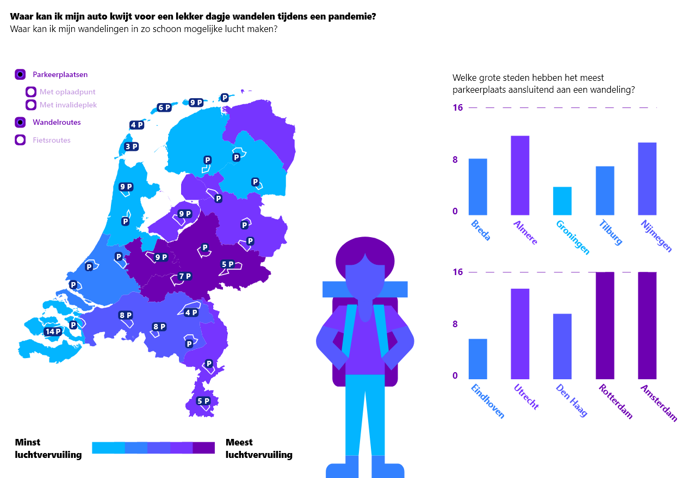
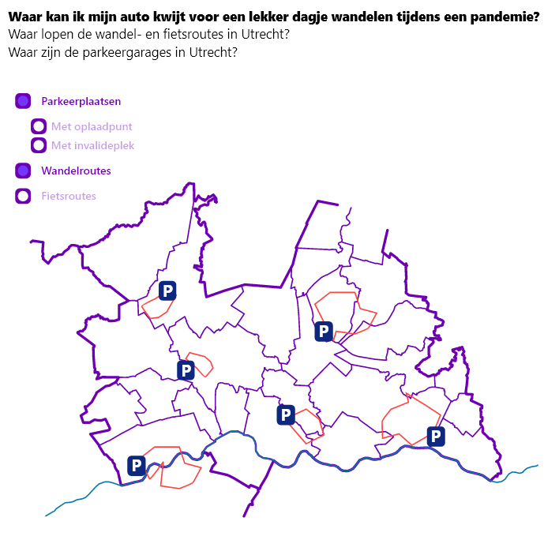

# frontend-data

## Volkskrant RDW data

### Onderzoeksvraag

> Waar in Nederland kan het best worden geparkeerd om direct bij een wandel- of fietsroute uit te komen?




## Subvragen

- Waar lopen de wandelroutes door Nederland?
- Welke parkeerplaatsen liggen dichtbij wandelroutes?
- Bij welke parkeerplaatsen moet je betalen tijdens het wandelen?
- Bij welke parkeerplaatsen kunnen er invaliden mee met de wandeling?
- Bij welke parkeerplaatsen kan de elktische auto worden opgeladen?
- Bij welke wandelroutes is de lucht het schoonst?

## Datasets

Om deze data te kunnen visualiseren heb ik uit de RDW data de data nodig die precies laat zien waar alle parkeerplaatsen zijn door heel Nederland.  
[Geokaart van alle parkeergarages](https://opendata.rdw.nl/Parkeren/GEO-Parkeer-Garages/t5pc-eb34)

Ook heb ik een externe dataset nodig die de wandel- en fietsroutes laat zien door heel Nederland. Dit ga ik doen met de data van de [Routedatabank](https://kaarten.routedatabank.nl/index.php?@RaadplegenWandelroutes), deze data is alleen niet voor iedereen beschikbaar en moet worden aangevraagd. Dit heb ik gedaan en ik wacht nog op reactie.

## Visualisatie

Het idee voor de visualisatie is een geografische kaart waar de parkeerplaatsen worden weergegeven waar je het best naartoe kan gaan om te gaan hardlopen of fietsen. Er kan op meerdere variabelen worden gefilterd. Ook zou een overzicht van welke wandelroutes en parkeerplaatsen de meeste luchtvervuiling hebben. Ook kan er worden gefilterd op of de parkeerplaats betaald of niet mag zijn. Ook zou de bezetting van de parkeerplaats erbij kunnen om aan te geven of er vaak plek is of niet. Er is in ieder geval genoeg interessante parkeerdata om aan de wandeldata toe te voegen.

## Clone dit project

1. Clone de repository in de terminal

```git
git clone https://github.com/SimonPlanje/frontend-data.git
```

2. Open de bestanden in VScode
3. Installeer de liveSever exentie op VScode
4. Linker muisknop op de index.html en klik op Start Liveserver
5. Enjoy :)

## Bronnen

- https://www.d3-graph-gallery.com/graph/bubblemap_buttonControl.html
- http://bl.ocks.org/ZJONSSON/3918369
- https://stackoverflow.com/questions/47870887/how-to-fill-in-missing-keys-in-an-array-of-objects/47871014#47871014?newreg=7adc7a5e48b7436d99619b4aad68d8f8
- https://stackoverflow.com/questions/50023291/add-id-to-array-of-objects-javascript
- https://www.youtube.com/watch?v=BMUiFMZr7vk&t=554s
- https://curran.github.io/dataviz-course-2018/

MIT License
